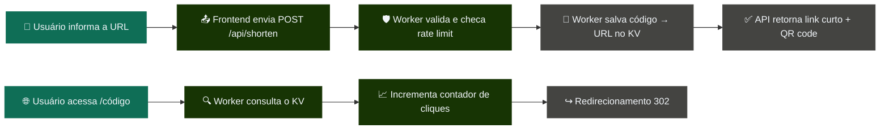

<div align="center">


# 🔗 Linkael

### Encurtador de links serverless com Cloudflare Workers e KV

<br>

[](https://linkael.SEU-SUBDOMINIO.workers.dev)
[](https://github.com/SEU-USUARIO/linkael)

<br>

[](https://workers.cloudflare.com/)
[](https://developers.cloudflare.com/kv/)
[](https://developer.mozilla.org/pt-BR/docs/Web/JavaScript)
[](https://vitest.dev/)
[](https://github.com/features/actions)

</div>


## 📑 Índice

`Sobre` · `Funcionalidades` · `Stack` · `Como funciona` · `Arquitetura` · `Rodando localmente` · `Testes` · `Deploy` · `API` · `Decisões técnicas` · `Melhorias futuras` · `Autor`


## Sobre

> **Linkael** transforma URLs longas em links curtos e memoráveis, com uma arquitetura 100% serverless que roda direto na borda da rede Cloudflare — sem servidor para gerenciar e com resposta praticamente instantânea.

O projeto nasceu como exercício de Cloud Computing e evoluiu para um encurtador completo: gera links com código automático ou personalizado, controla acessos com rate limiting, mede o desempenho de cada link com um contador de cliques, e ainda gera um QR code automático para cada link criado.

<div align="right"><a href="#-índice">⬆ voltar ao topo</a></div>


## Funcionalidades

<table>
<tr>
<td width="33%" valign="top">

**🔗 Encurtamento inteligente**
Aceita URLs com `http://` ou `https://` e gera um link curto pronto para compartilhar.

</td>
<td width="33%" valign="top">

**🎲 Código automático**
Geração automática de código curto com 6 caracteres alfanuméricos.

</td>
<td width="33%" valign="top">

**✏️ Código personalizado**
Suporte a slugs customizados, como `/meu-link`.

</td>
</tr>
<tr>
<td width="33%" valign="top">

**📊 Contador de cliques**
Cada link acompanha quantas vezes foi acessado, disponível via API de estatísticas.

</td>
<td width="33%" valign="top">

**🧾 QR code automático**
Ao gerar um link, um QR code é exibido na hora para compartilhamento offline.

</td>
<td width="33%" valign="top">

**🛡️ Rate limiting**
Limite de requisições por IP no endpoint de criação, prevenindo abuso.

</td>
</tr>
<tr>
<td width="33%" valign="top">

**✅ Validação completa**
Verificação de formato de URL e do código personalizado informado.

</td>
<td width="33%" valign="top">

**🚫 Códigos reservados**
Bloqueio de códigos que conflitariam com rotas internas da aplicação.

</td>
<td width="33%" valign="top">

**🔍 Anti-duplicidade**
Checagem de código já existente antes de salvar no KV.

</td>
</tr>
<tr>
<td width="33%" valign="top">

**↪️ Redirecionamento 302**
Redirecionamento automático para a URL original ao acessar o link curto.

</td>
<td width="33%" valign="top">

**🧪 Testes automatizados**
Cobertura de validações com Vitest, rodando no CI a cada push.

</td>
<td width="33%" valign="top">

**⚙️ CI/CD**
Deploy automático via GitHub Actions após os testes passarem.

</td>
</tr>
</table>

<div align="right"><a href="#-índice">⬆ voltar ao topo</a></div>


## Stack

<div align="center">


</div>

| Tecnologia | Papel no projeto |
|---|---|
| **Cloudflare Workers** | Executa o backend serverless e roteia as requisições |
| **Cloudflare KV** | Armazena código, URL original, cliques e data de criação |
| **Wrangler** | Ferramenta de desenvolvimento e deploy da Cloudflare |
| **Vitest** | Testes unitários das regras de validação |
| **GitHub Actions** | Pipeline de testes e deploy automático |
| **HTML, CSS e JavaScript** | Interface web sem dependências de framework |

<div align="right"><a href="#-índice">⬆ voltar ao topo</a></div>


## Como funciona



1. O usuário cola a URL original e, opcionalmente, informa um código personalizado.
2. O frontend envia os dados para `/api/shorten`.
3. O Worker checa o rate limit, valida a URL e o código, evitando conflitos com códigos já existentes.
4. O Cloudflare KV salva o registro `{ url, clicks, createdAt }` na chave do código.
5. A aplicação retorna o link curto e exibe um QR code gerado na hora.
6. Ao acessar o link curto, o Worker busca o destino no KV, incrementa o contador de cliques e redireciona automaticamente.

<div align="right"><a href="#-índice">⬆ voltar ao topo</a></div>


## Arquitetura

O projeto roda sem servidor tradicional. O frontend é servido como asset estático e o backend fica concentrado em um Worker, com as regras de validação isoladas em um módulo separado para facilitar os testes.

```text
linkael/
├── public/
│   ├── index.html
│   ├── style.css
│   └── script.js
├── src/
│   └── validators.js
├── test/
│   └── validators.test.js
├── .github/
│   └── workflows/
│       └── deploy.yml
├── worker.js
├── wrangler.toml
├── package.json
├── API.md
└── README.md
```

- 📨 `worker.js` recebe requisições de encurtamento em `POST /api/shorten`, serve os arquivos estáticos e redireciona os códigos curtos.
- 🧩 `src/validators.js` concentra as regras de validação, testadas isoladamente em `test/validators.test.js`.
- ⚙️ `.github/workflows/deploy.yml` roda os testes a cada push/PR e faz o deploy automático quando a branch `main` é atualizada.

<div align="right"><a href="#-índice">⬆ voltar ao topo</a></div>


## Rodando localmente

> **Pré-requisitos:** Node.js instalado · conta na Cloudflare · Wrangler instalado (ou executado via `npx`)

```bash
git clone https://github.com/SEU-USUARIO/linkael.git
cd linkael
npm install
wrangler login
wrangler dev
```

Por padrão, o Wrangler inicia o projeto em:

```text
http://127.0.0.1:8787
```

Para criar um namespace KV na Cloudflare:

```bash
wrangler kv namespace create LINKS
```

Depois, copie o `id` gerado para o binding `LINKS` no arquivo `wrangler.toml`.

<div align="right"><a href="#-índice">⬆ voltar ao topo</a></div>


## Testes

```bash
npm test
```

Os testes cobrem as regras de validação de URL, código personalizado e códigos reservados. O mesmo comando roda automaticamente no GitHub Actions a cada push ou pull request.

<div align="right"><a href="#-índice">⬆ voltar ao topo</a></div>


## Deploy

```bash
wrangler deploy
```

O deploy publica o Worker, disponibiliza os arquivos estáticos e conecta a aplicação ao namespace KV configurado na conta Cloudflare.

Para deploy automático via GitHub Actions, adicione o secret `CLOUDFLARE_API_TOKEN` nas configurações do repositório (Settings → Secrets and variables → Actions). O token pode ser gerado em [Cloudflare Dashboard → My Profile → API Tokens](https://dash.cloudflare.com/profile/api-tokens), usando o template "Edit Cloudflare Workers".

<div align="right"><a href="#-índice">⬆ voltar ao topo</a></div>


## API

Documentação completa dos endpoints em [API.md](./API.md).

<div align="right"><a href="#-índice">⬆ voltar ao topo</a></div>


## Decisões técnicas

- **Cloudflare KV** — escolhido porque o caso de uso principal é uma consulta chave-valor simples, ideal para mapear `código -> registro`.
- **Registro em JSON no KV** — em vez de salvar só a URL, o valor armazenado é um objeto `{ url, clicks, createdAt }`, permitindo estatísticas sem precisar de outro banco.
- **Rate limiting no próprio KV** — evita a necessidade de um serviço externo só para limitar requisições, usando `expirationTtl` para expirar a janela automaticamente.
- **Validações isoladas em `src/validators.js`** — separar regras de negócio da camada de rede facilita testes unitários sem precisar simular o runtime completo do Worker.
- **Redirecionamento 302** — evita cache permanente do destino pelo navegador.
- **Códigos reservados** — impedem conflito entre links personalizados e rotas internas como `/api` e `/stats`.

<div align="right"><a href="#-índice">⬆ voltar ao topo</a></div>


## Melhorias futuras

- [ ] Expiração automática de links (TTL configurável)
- [ ] Painel autenticado para gerenciar links
- [ ] Preview Open Graph ao compartilhar o link curto
- [ ] Analytics por país de origem do clique
- [ ] Domínio próprio conectado ao Worker

<div align="right"><a href="#-índice">⬆ voltar ao topo</a></div>


## Autor

<div align="center">

Desenvolvido por **Israel Menezes**.

[](https://github.com/SEU-USUARIO)
[](https://www.linkedin.com/in/raelmz/)
[](https://raeldev.vercel.app)

</div>


